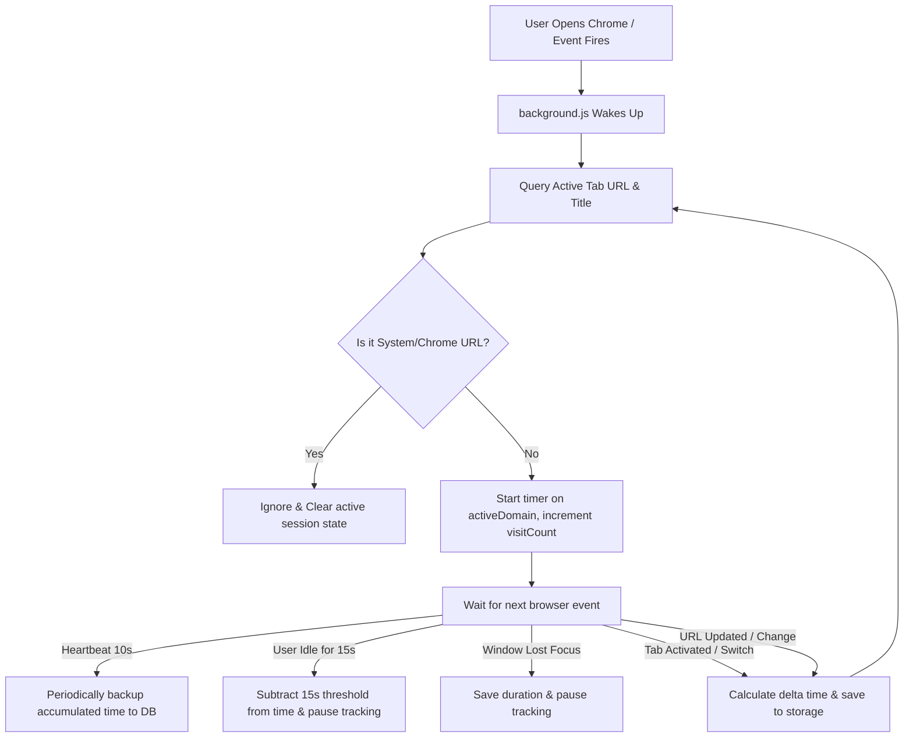

# PhantomTabs - Activity & Productivity Tracker (Chrome Extension MV3)

PhantomTabs is a professional, production-ready Google Chrome extension built using **Manifest V3** that tracks user browsing activities and presents detailed usage analytics inside a modern, glassmorphic dark-theme full-screen dashboard tab.

---

## 1. Folder Structure

The project has a clean, modular, and standard Chrome Extension layout:

```
c:\Users\acer\Desktop\stack\
├── manifest.json       # Extension metadata, permissions, active assets, and scripts registration
├── popup.html          # HTML structural layout for the glassmorphic dashboard
├── styles.css          # Custom CSS for dark-theme variables, glassmorphic cards, and custom scrollbars
├── popup.js            # Frontend controller (manages tab navigation, filters, blocklist, CSV exports)
├── background.js       # Core tracking engine background service worker
├── content.js          # Injected content script for active page monitoring & Focus Mode screen blocking
├── analytics.js        # shared library for site categorization, productivity metrics, and CSV formatting
├── chart.umd.js        # Local Chart.js library for offline graphing (Web Store compliant)
└── icons/              # Extension logo icons
    ├── icon16.png      # Used in browser menus and lists (16x16)
    ├── icon48.png      # Displayed on the extensions management page (48x48)
    └── icon128.png     # Displayed in the Chrome Web Store and installation prompts (128x128)
```

---

## 2. Installation Steps (Local Development)

To load and test PhantomTabs locally in Google Chrome:

1. **Open Extensions Manager**:
   - In Google Chrome, navigate to `chrome://extensions/` by typing it in the address bar.
   - Alternatively, click the Chrome menu (three dots) -> **Settings** -> **Extensions** (bottom left).

2. **Enable Developer Mode**:
   - In the top-right corner of the Extensions page, toggle the **Developer mode** switch to **ON**.

3. **Load Unpacked Extension**:
   - In the top-left corner, click the **Load unpacked** button.
   - A file selection dialog will open. Navigate to and select the project root folder:
     `c:\Users\acer\Desktop\stack`
   - Click **Select Folder**.

4. **Pin the Extension**:
   - Click the jigsaw-puzzle icon (Extensions toolbar button) in the upper-right corner of Chrome.
   - Locate **PhantomTabs - Activity & Productivity Tracker** and click the **Pin** pin-icon next to it to lock it to your toolbar.

5. **Open the Dashboard**:
   - Click the **PhantomTabs** toolbar icon. The extension will automatically intercept the click and launch the dashboard in a beautiful, full-screen browser tab (`popup.html`) rather than a cramped popup window.

---

## 3. Permissions Explanation

PhantomTabs requests the minimum set of permissions necessary to function, maintaining maximum privacy:

*   `"storage"`:
    *   **Reason**: Required to save daily and weekly usage history records and preferences (e.g. Focus Mode blocklists, daily threshold settings). Data is stored entirely locally on the user's hard drive and is never uploaded to external servers.
*   `"tabs"`:
    *   **Reason**: Gives the background script access to the URL and title of the active tab. This is crucial for identifying which website you are currently visiting so that time can be allocated to the correct domain.
*   `"idle"`:
    *   **Reason**: Used to detect when the user is inactive. PhantomTabs checks keypress and mouse movements via the browser. If the user stops interacting with the computer for more than 15 seconds, tracking is automatically paused, preventing incorrect time accumulation (e.g. when stepping away from the desk or leaving Chrome open overnight).
*   `"notifications"`:
    *   **Reason**: Sends standard desktop push alerts when the user hits their configured daily browsing allowance limit (e.g. 2 hours).
*   `host_permissions` (`"<all_urls>"`):
    *   **Reason**: Required by the content script to run on web pages. It enables PhantomTabs to intercept visits to domains on your custom blocklist when Focus Mode is activated, replacing them with a custom glassmorphism focus lock screen.

---

## 4. How Activity Tracking Works Internally

PhantomTabs uses an event-driven system inside a Manifest V3 Background Service Worker (`background.js`) to capture browsing metrics accurately:



### Key Technical Subsystems:

1.  **State Reconstruction (Service Worker Lifecycles)**:
    *   In Manifest V3, background pages are replaced by transient Service Workers that go to sleep after ~30 seconds of inactivity. To prevent data loss, the tracking start time (`startTime`) and current domain are continually synced to `chrome.storage.local` under the `activeSession` key. When the service worker wakes up on any browser event (like a new click), it reads this key, calculates the time elapsed since the saved start time, adds it to the database, and resets the timer.
2.  **Domain Matching & Normalization**:
    *   Every URL visited is parsed inside `analytics.js` using the native `URL` class. The hostname is extracted, and the leading `www.` prefix is stripped to normalize domains (e.g. `https://www.github.com/google/flatbuffers` becomes `github.com`).
3.  **Active Window Monitoring**:
    *   `chrome.windows.onFocusChanged` detects when the user switches to a different desktop application (like a text editor or terminal). When Chrome loses focus, tracking pauses immediately.
4.  **Idle State Rollover**:
    *   When `chrome.idle.onStateChanged` signals that the system has transitioned to `"idle"`, the engine rolls back the session clock by 15 seconds (the detection window) and pauses, discarding the idle time.
5.  **Data Structure**:
    *   Usage logs are written daily under a date key (e.g., `2026-05-25`) inside `chrome.storage.local`. Each date entry stores domains, their associated time spent, visit counts, and an array of 24 integers representing seconds spent during each hour of the day.

---

## 5. Chrome Web Store Publishing Guide

To publish PhantomTabs on the official Chrome Web Store, follow these steps:

### Step 1: Zip the Extension
Compress all project files into a single ZIP file. Make sure `manifest.json` is at the root of the ZIP file:
- Select `manifest.json`, `popup.html`, `styles.css`, `popup.js`, `background.js`, `content.js`, `analytics.js`, `chart.umd.js`, and the `icons` directory.
- Right-click and choose **Compress to ZIP file** (name it `phantomtabs-tracker.zip`).

### Step 2: Register for a Chrome Developer Account
1. Go to the [Chrome Web Store Developer Console](https://chrome.google.com/webstore/devconsole/).
2. Sign in with a Google account.
3. Pay the one-time $5 USD developer registration fee (required by Google to prevent spam submissions).

### Step 3: Upload the Extension
1. Inside the Developer Console, click **Add new item** (top-right).
2. Drag and drop your `phantomtabs-tracker.zip` file.
3. The console will automatically parse the `manifest.json` file. If there are any syntax errors or missing permissions, they will be reported here.

### Step 4: Fill Out Store Listing Details
Provide details for the public Store Listing page:
*   **Product Details**: Title, Description (use a compelling overview of features).
*   **Icons**: Upload a 128x128 PNG (you can use `icons/icon128.png`).
*   **Screenshots**: Provide at least one 1280x800 or 640x400 screenshot of the popup dashboard in action.
*   **Category**: Select **Productivity**.

### Step 5: Configure Privacy and Security Options
*   **Single Purpose**: Confirm that the extension has one main purpose (Time & Productivity Tracking).
*   **Permission Justification**: Explain why the extension requests the following permissions:
    *   `tabs`: To read current tab URLs and calculate site time.
    *   `storage`: To persist stats logs locally.
    *   `idle`: To pause tracking when the user walks away from the PC.
    *   `notifications`: To alert users when daily limit boundaries are met.
*   **Host Permissions**: Explain that `<all_urls>` is necessary for Focus Mode site blocking.
*   **Data Usage**: Certify that all data is kept local to the user's browser storage and is **not** transmitted to remote servers.

### Step 6: Submit for Review
1. Click **Submit for review**.
2. The Chrome Web Store team reviews MV3 extensions. The review typically takes between **24 to 72 hours**. Once approved, it will be immediately available in the Store.
